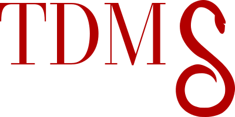

<h1 align="center">
<br><strong>TDMS Converter</strong>
</h1>

A GUI that converts LabVIEW tdms files to other formats (currently only csv). The converter produces a csv file per each group inside the tdms file.

The GUI was written and converted to an exe file as it was required to easily run on a Windows operating system locally. However, one can run it using docker or a Python Virtual Environment.

# 💡 Motivation

The idea behind this application came about because my partner uses LabVIEW to record sensor data and store it in tdms files. Then she would use an Excel plugin to convert the tdms files to xlsx files and open/read them with Excel.

This process usually works fine, unless a tdms file is gigantic and larger than Excel's row limit. Unfortunately, Matlab functions that are available online for her version of Matlab would not convert the tdms files either, due to format compatibility issue. These functions were also relatively sizable files and not quite easy to edit and decipher.

So, I decided to use Python's npTDMS library to write a script (with only two lines of code) and convert her tdms files to csv and allow her to use them for further analysis. She liked the outcome so I changed that python script to a command line tool and converted it into an exe for her to allow her to use that on a local and somewhat restricted machine.

I noticed that other academics also rely on LabVIEW and tdms files and therefore, given that the command line tool was received well, I decided to make a simple GUI application to accomplish the same function as the command line tool, but in a more accessible, interactive and user-friendly manner.

# 🕹️ Main Feature

- Convert tdms files into csv files. A csv file is created per group ☄️.
- Use npTDMS for tdms conversion. Pandas and numpy for data processing. PyQt5 for The user-interface ✨.
- Includes a local exe file for running conversions on Windows and locally/offline 🔥.
- The user-interface includes a **Dark Mode** 😎 as well as the classic mode 👌.
- A dockerised environment and a Python Virtual Environment are available for using the application as well as further developing it 🚀.

# 🔧 Usage

## 💾 Exe File

The easiest way to use TDMS Converter is to download the exe file on a Windows operating system from [Source Forge](https://sourceforge.net/projects/tdmsconverter/files/TDMS%20Converter_v0.1.exe/download).

After executing the ```TDMS Converter.exe```, the following window should appear:


Browse to your tdms file and then browse to the directory you wish to save the resultant csv file (i.e. the destination path). Then press the Convert button.

The application will save your csv file with the same name as the tdms file suffixed with group names inside your tdms file. For example, if your tdms file is called ```test.tdms``` and has groups ```groupA```, ```groupB``` and ```groupC``` in it, the converter will make 3 csv files in the selected directory called:

```test_groupA.csv```

```test_groupB.csv```

```test_groupC.csv```


### 🤩 Bonus

Clicking on the ```Edit``` button on the menu bar at the top of the application allows one to toggle the style of the application and activate the **Dark Mode** 🌈.


## 🖥️ Docker

In the root path open a terminal and run:

```shell
docker-compose up
```

PyQt GUI window should pop up after your container is up and running. The way the ```docker-compose.yaml``` file is set up allows you to make changes to your code and then press the close button for the app to pop up again and reflect your new changes.

Note that the docker-compose was tested on a linux system only. If for whatever reason the docker solution does not work, one can always utilise the virtual environment option.

Furthermore, adding ```pyqt5-tools``` to the ```requirements.txt``` install Qt Designer and other useful tools to allow you to convert your GUI designs to python code quite easily and make a suite of Qt development tools available to you in your containerised environnement.

## 🤖 Python Virtual Environment

Clone this repo and in the root/base directory create your virtual environment:

```shell
python -m venv projectname
```
Then activate your virtual environment:

```shell
./projectname/Scripts/activate
```

Then install the dependencies in the ```requirements.txt``` file inside your virtual environment using:

```shell
pip3 install -r requirements.txt
```

A python 3.8 virtual environment was used for development of this project.

Whilst your virtual environment is activated you can run the app by:

```shell
python ./main.py
```

Furthermore, adding ```pyqt5-tools``` to the ```requirements.txt``` install Qt Designer and other useful tools to allow you to convert your GUI designs to python code quite easily and make a suite of Qt development tools available to you in your containerised environnement.

# 👀 Create Your Own Exe File

## 📋 Option 1: Using pyinstaller

One could install pyinstaller:

```shell
pip3 install pyinstaller
```

And then run the following:

```shell
pyinstaller --noconfirm --onefile --windowed --icon "path/to/tdms-logo.ico" --add-data "path/to/src;src/"  "path/to/main.py"
```

## 📋 Option 2: Using Auto PY to EXE

One of my favourite applications. Please feel free to visit their repository at:

[https://github.com/brentvollebregt/auto-py-to-exe](https://github.com/brentvollebregt/auto-py-to-exe) 

After pip installing their application, use the following configuration:

